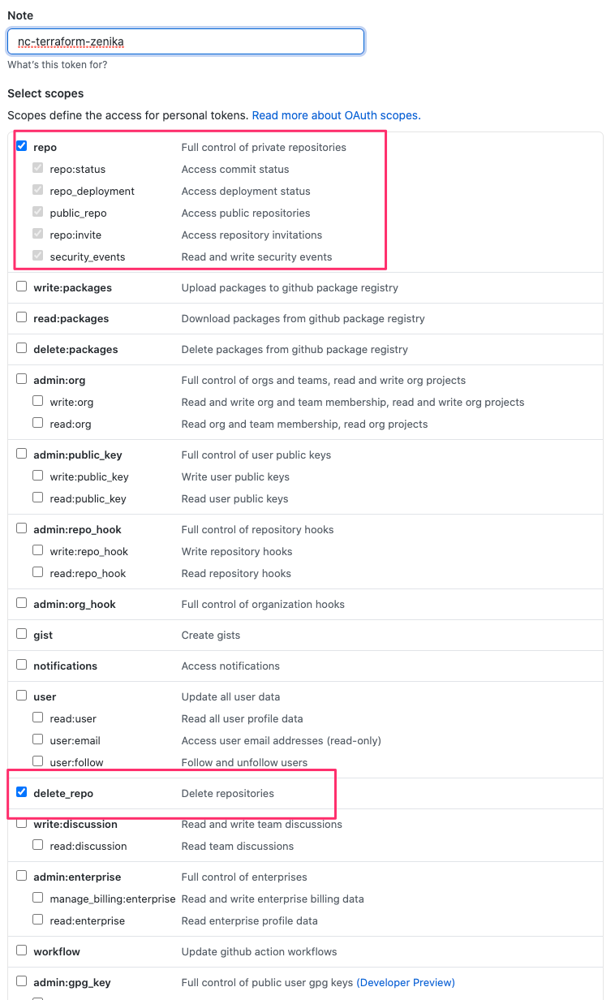

# LAB 1

## VScode 

N'oubliez pas d'installer les plugins `indent-rainbow` et `HashiCorp Terraform`.


## Provider

Créer un fichier `provider.tf` afin de configurer le provider **github** avec vos crédentials:

```hcl
provider "github" {
  token = var.github_token
  owner = var.github_owner
}
```

Ainsi qu'un fichier `variables.tf` avec le contenu suivant:

```hcl
variable "github_token" {
  type = string
  description = "Your personal Github token"
}

variable "github_owner" {
  type = string
  description = "Your personnal Github account"
}
```

Allez sur le lien <https://github.com/settings/tokens> afin de générer un token.



Exporter les variables d'environnements suivantes:

```bash
# Your GH account
export TF_VAR_github_owner=yyyyyy
# Your GH token
export TF_VAR_github_token=xxxxxxxxxxxx
```

Puis lancer la commande `terraform init` afin d'initialiser le workspace.

## Resources

### github_repository

Dans un fichier main.tf, créer un nouveau repository privé Github en utilisant la ressource `github_repository`

```hcl
resource "github_repository" "example-1" {
  name             = "nc-terraform-example-1"
  description      = "My awesome codebase"
  visibility       = "private"
  has_wiki         = false
  license_template = "mit"
}

```

La documentation de la ressource est disponible à cette adresse: <https://www.terraform.io/docs/providers/github/r/repository.html>

Puis lancer `terraform apply` pour lancer la création du repository Github.

Rendez vous sur <https://github.com/snahelou?tab=repositories> afin de vérifier que le repository est bien créé.

### github_branch

Maintenant que le repo est créé, on va pouvoir ajouter une branch `develop`

Afin de créer cette branche sur le repo créé précédement, on va pointer la référence dans le champ `repository`

```hcl
resource "github_branch" "develop" {
  repository = github_repository.example-1.name
  branch     = "develop"
}
```

Lancer la commande `terraform apply` pour appliquer cet ajout et vérifier que la branche a bien été créée.

### github_repository_file

On souhaiterait initialiser un fichier `README.md` dans notre repo.

Créer un fichier `README.md.tmpl` dans un répertoire `templates`  votre workspace:

```bash
mkdir templates
```

```bash
cat << EOF >> templates/README.md.tmpl

<p align="center">
  Best repository ever seen
</p>


## Table of contents

  * [Common usage](#common-usage)
  * [Installation](#installation)
  * [Examples](#examples)
  * [Contributing](#contributing)
  * [License](#license)

## Common usage

Let me show you how it works :)

## Installation

Let me show you how to install

## Examples

Let see some examples

## Contributing

You may contribute in several ways like creating new features, fixing bugs, improving documentation and examples
or translating any document here to your language. [Find more information in CONTRIBUTING.md](CONTRIBUTING.md).

## License

[MIT](LICENSE)

EOF
```

Un fois le template créé (nous y reviendrons pas la suite), modifier votre `main.tf` afin d'ajouter la création du fichier `README.md` et appliquer la modification.

```hcl
resource "github_repository_file" "readme" {
  repository = github_repository.example-1.name
  file       = "README.md"
  content    = templatefile("${path.module}/templates/README.md.tmpl", {})
}
```

Votre repository est maintenant initialisé ! :)
