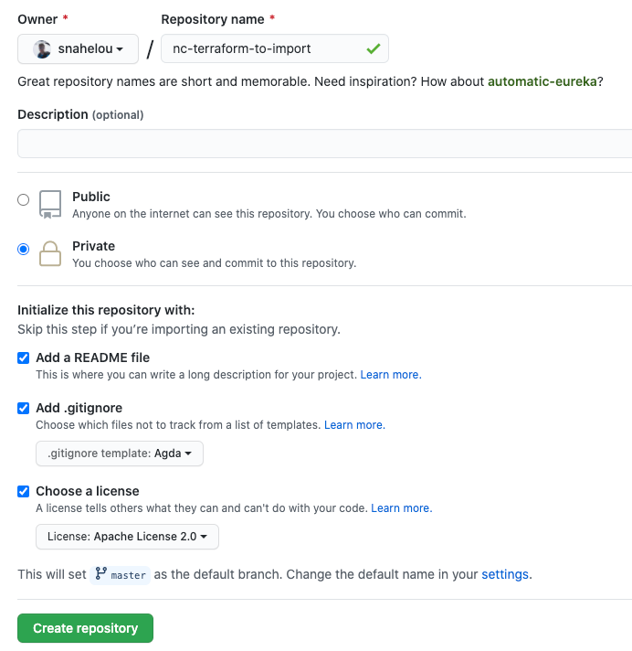

# lab-2

## Terraform import

Créer manuellement un nouveau repository



Ajouter une resource `github_repository` en spécifiant uniquement le nom

```hcl
resource "github_repository" "example-2" {
  name             = "nc-terraform-to-import"
}
```

Lance la commande `terraform import` afin de rattacher ce repository à votre workspace terraform.

```hcl
$ terraform import github_repository.example-2 nc-terraform-to-import

github_repository.example-2: Importing from ID "nc-terraform-to-import"...
github_repository.example-2: Import prepared!
  Prepared github_repository for import
github_repository.example-2: Refreshing state... [id=nc-terraform-to-import]

Import successful!

The resources that were imported are shown above. These resources are now in
your Terraform state and will henceforth be managed by Terraform.
```

Vérifier la présence de votre repository dans votre tfstate

```bash
cat terraform.tfstate | jq '.resources[] | select (.type == "github_repository")'
```

Commenter les lignes suivantes et lancer un `terraform apply` afin de supprimer le repo

```hcl
#resource "github_repository" "example-2" {
#  name             = "nc-terraform-to-import"
#}
```