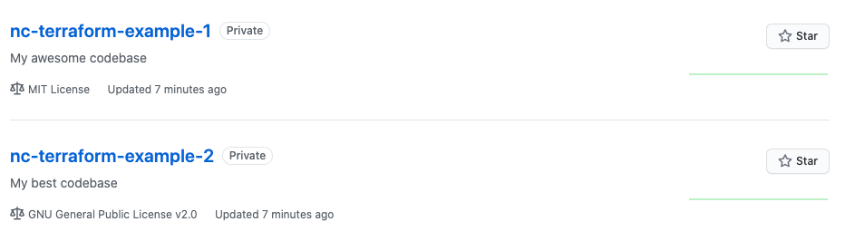

# LAB 4

## Nettoyage

Avant de modulariser notre module. N'oubliez pas de supprimer le repo github via la commande `terraform destroy`

## Modularisation

Créer le répertoire `modules/gh-repo` et y déplacer votre code

```bash
mkdir -p modules/gh-repo
mv *.tf modules/gh-repo
mv templates modules/gh-repo/
rm terraform.tfstate terraform.tfstate.backup terraform.tfvars
```

```bash
$ tree modules/gh-repo/
modules/gh-repo/
├── main.tf
├── provider.tf
├── templates
│   └── README.md.tmpl
└── variables.tf
```

Créer un nouveau fichier `main.tf` dans le répertoire courant, et y déclarer votre module.

```hcl
module "gh-repo" {
  source = "./modules/gh-repo"

  github_token = var.github_token
  github_owner = var.github_owner
  
  repo_name = "nc-terraform-example-1"
  repo_description = "My awesome codebase"
  repo_license_template = "mit"
}
```

Ainsi qu'un fichier `variable.tf`

```hcl
variable "github_token" {
  type = string
  description = "Your personal Github token"
}

variable "github_owner" {
  type = string
  description = "Yout personnal Github account"
}
```

N'oubliez pas de faire un `terraform init` avant votre `terraform plan` (inutile de faire un apply à ce stade...)
 
## For each loop

Nouveauté de cette 0.13, nous pouvons désormais faire une boucle sur la creation de module.

Pour pouvoir utiliser ce for_each, nous devons d'abord nettoyer notre module de son provider. (voir <https://github.com/hashicorp/terraform/issues/25120>)

Dans votre module `gh-repo`, supprimer le fichier `provider.tf` ainsi que les 2 variables du `variables.tf`


Ensuite, à la racine du workspace, dans votre `variables.tf`, ajoutez la variables repositories:

```hcl
variable "repositories" {
  type = map(object({
    name           = string
    description    = string
    license        = string
  }))
}
```

N'oubliez pas le `provider.tf` à la racine d workspace:

```hcl
provider "github" {
  token = var.github_token
  owner = var.github_owner
}
```

Ensuite modifier votre `main.tf` pour utiliser ces variables:

```hcl
module "gh-repo" {
  source = "./modules/gh-repo"

  for_each = var.repositories

  repo_name = each.value.name
  repo_description = each.value.description
  repo_license_template = each.value.license
}

```

Et finalement fournir un `terraform.tfvars` avec 2 repository:

```hcl
repositories={
  repo-1 = {
    name = "nc-terraform-example-1"
    description = "My awesome codebase"
    license = "mit"
  },
  repo-2 = {
    name = "nc-terraform-example-2"
    description = "My best codebase"
    license = "gpl-2.0"
  }
}
```

Et voila !


